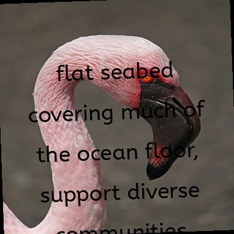

## Experiments
[ ] Try contrastive loss
[ ] Try triplet loss
[ ] Experiment with weight decay
[ ] Test single conv layers vs back to back conv layers between downsamples
[ ] Add a wandb config file and sweep conv sizes
[ ] Compare my model to a LoRA of gemmapali or a multimodal llama


### Adversarial Fonts
Alex Brush

# Character Level Model
## Create detection labels
font-detection-dataset/
  └── arial/
      ├── sample_0000.jpg  # Full paragraph image
      ├── sample_0001.jpg
      └── annotations/
          ├── sample_0000.txt  # YOLO format: "class_id x_center y_center width height" 
          ├── sample_0000.json # Raw JSON with character data
          ├── sample_0001.txt
          └── sample_0001.json
      └── classes.txt  # Mapping of class_id to characters

## Overview
Convert input to RGB (if not already) for CRAFT  
Run CRAFT detection on RGB image   
Extract character patches from RGB image  
Convert each patch to grayscale  
Normalize and resize patches for classification  
Feed grayscale patches to the character classifier  


### Challenge: what structure do the images need to have to work with CRAFT text detector
- expecting a color image with 3 channels
- /CRAFT/model.py expects a PIL Image object
- non square images, "The longer sides of the images within TotalText and CTW-1500 are resized to 1280 and
1024, respectively" (section 4.3 https://arxiv.org/pdf/1904.01941)
- need to figure out how our model will handle non square images
    - dumb easy thing is just to resize despite potential distortion


### Challenge: what size should the input images be and what size font should we use?
- Bigger images can fit more text, but the amount of memory is quadratic in the image size, so we need to be careful about how big we make them.


### Challenge: what size, format, color space should the input images be and what size font should we use?
- Bigger images can fit more text, but the amount of memory is quadratic in the image size, so we need to be careful about how big we make them.  
- Bigger text size gives more pixels for each character, which in theory gives us a stronger signal to classify off of, but it also mean we are getting fewer characters per image.  
- CRAFT expects 3 channel image  
- Patch level character CNN should probably just be in grayscale since we care about shape not color and that should still be preserved. 

The official craft implementation by default tests with 768x768 images (https://github.com/clovaai/CRAFT-pytorch/blob/master/craft.py#L84C5-L84C58)
`output, _ = model(torch.randn(1, 3, 768, 768).cuda())`  
 
 
so if nothing else we can use that as a prior on what size we should feed in if we want the best results out of craft without having to do any tuning. That said, "the most performance you get without without tweaking the weight" is like "the most fun you can have with your pants on", but we will save this for after we do more data augmentations to the input images. 

### Challenge: currently the character detection labels we have are non rectangular
- Fixed-size square patches: Force all bounding boxes to be squares with consistent dimensions, even if that means including more whitespace for some characters. This ensures consistent scale, but loses aspect ratio information.
- Augmentation: Use data augmentation to help the network become invariant to aspect ratio and size variations.
- Aspect ratio preservation: When resizing for the network, maintain the aspect ratio by adding padding rather than distorting the character.-
- Character-type embedding: Include information about which character it is as an additional input to the network, allowing it to adjust for character-specific features.


# Deployment 
Adding a makefile for local development (builds whatever is currently in the codebase)
https://claude.ai/chat/eb0fce0e-7b73-455e-8d6e-6472738188e4
otherwise need to push a commit through GH actions for the image to be made


[ ] move the class embedding generation into prep train test data.py? Otherwise go back to using a class embedding argument in the frontend_app.py instead of searching for it in the dataset folder 
[ ] fix the error when uploading an image
[ ] add some processing to resize images coming in and make them single channel
[ ] remove the model saving part for the sweep. once we know which model trains best we can retrain it and reanble the saving.
[ ] cleanup the metrics 
- [ ] is the epoch time metric actually telling me how long an epoch takes?


[X] Figure out how to keep track of the model experiments - use weights and biases 
[X] Test my model on cifar dataset instead to sanity check that it is capable of learning anything  
[X] create a small test dataset for iterating on the model - font-dataset-npz_test  
[X] make it so that it only saves the class averages at the end of training instead of everytime a new best model gets saved  
[X] Establish simple conv baseline for the encoder
[X] add a LR warmup and cosine learning rate  
[ ] Test a resnet as the encoder
[ ] Test a resnet with supervised contrastive loss (does it need to be a pretrain)


# Training on Alienware
- ssh timholds@192.168.68.125
    - setup ssh keys 
    - Creating a simple shell script to automate the sync + train process
- pull github repo with the latest model file 
- use github DVC w/ free tier of S3?


# Deployment
clear up confusion around the deployment steps
create the deployment directory
do i need to create the deployment directory with the script locally?
what if i copy paste all the files needed to launch the server into a specific folder and then just copied the folder
- need to copy the model folder into ml

[X] get a digital ocean ubuntu 22.04 server, 1GB RAM
- `ssh -i ~/.ssh/digitalocean root@137.184.232.187` mac or just
- `ssh root@137.184.232.187` from linux
[X] run the `deploy-structure.sh` script locally  
`chmod +x deployment/scripts/deploy-structure.sh`  
`./deployment/scripts/deploy-structure.sh`  
[X] copy over the deployment
`sudo rsync -avz deployment/ root@137.184.232.187:/var/www/freefontfinder/deployment/`
[X] copy of ml.model, class_embeddings, frontend_app.py,and frontend_requirements.txt. 
```
rsync -avz \
    deployment/ \
    root@137.184.232.187:/var/www/freefontfinder/deployment/
```
``` 
rsync -avz \
    frontend_app.py \
    frontend_requirements.txt \
    root@137.184.232.187:/var/www/freefontfinder/
```  
```
rsync -avz \
    templates/frontend.html \ 
    root@137.184.232.187:/var/www/freefontfinder/templates/
```   
```
rsync -avz \
    data/font-dataset-npz/fontCNN_BS64-ED512-IC32.pt \
    data/font-dataset-npz/class_embeddings_512.npy \ 
    data/font-dataset-npz/label_mapping.npy \
    root@137.184.232.187:/var/www/freefontfinder/model/
```  
make sure the setup script is executable on the server
`chmod +x /var/www/freefontfinder/deployment/setup.sh`

[X] configure the setup script correctly install dependencies on server  
[ ] (optional) find a lightweight version of pytorch  
[X] get a domain and have it point to the server
[X] get SSL working
[ ] setup a github actions to deploy to the server on push to main  
    - .github/workflows/deploy.yml


## Deployment Improvements 
Frontend Enhancements
-Add proper styling (the CSS file is missing)
-Add error handling for failed predictions
-Add loading states during image processing


Monitoring & Maintenance
-Set up proper application monitoring
-Implement backup strategy
-Add more comprehensive error logging


Security Enhancements
- Consider rate limiting
-Add input validation
-Implement file upload size limits
-Consider adding request logging for security monitoring


Performance Optimization
-Add caching for static assets
-Optimize model loading
-Consider CDN for static files

## TODO 
[X] figure out a workflow for deployment 
    - need to copy over the 
    - gather model file, embeddings file, 
    - what files do i need to copy over for the deployment? just the frontend_app - maybe make a frontend_requirements.txt? need flask, pytorch (pytroch lite?)
[ ] add test_e2e.py to github actions when merging develop into main
- update the script to automatically upload an image to the server and check the response


## ML Steps
Simple baseline model
Get a model to overfit
Regularize
Try a more complex model
Try a more complex model with more data
Try a more complex model with more data and more regularization
Try a more complex model with more data and more regularization and more data augmentation
[ ] Visualize model predictions some small holdout batch every epoch


## Bugs
[x] critical:  there's an off by one error in the labels mapping. When I try to use a super overfit model on the frontend, it returns the wrong class with super high certainty! Checking this out closer, I notice it's predicting the class 1 off from the correct class. For example, on an image of the "yesseva" font, the model predicts "yesteryear" with 99.5% certainty. 


# ML TODO
[ ] model experimentation: data augmentation - vary positioning/layout, font size and style, color and background color, text itself  
[ ] try a clip model of same font different font?  
[ ] train a classifier model and use the average class features to find which classes are closer or more similar to each other and return the top 5  
[ ] do we get anything out of top eigenvectors of the data covariance matrix  
[ ] distance between their mean images 
[ X ] how can i make the model name legible / get returned from the train script? the filename itself has some of the hyperparams baked in - for example `fontCNN_BS64-ED512-IC16.pt`  
- solution: create a ml.utils file with get_model_path()

# Misc
- try uploading to huggingface again

Do I need to do any regularization?


figure out how to combine steps in one script for gathering data and training the model
1) generate the data, save the data, prep_train_test_data.py     
2) train, generate class embeddings, save class embeddings, launch flask app  


## Questions
[ ] does it matter whether you take the class average over the train set vs the validation or test set?  


## Questions
[ ] does it matter whether you take the class average over the train set vs the validation or test set?  

## Compression
How are we handling compression?
What does image compression actually mean? Explain why it would be nonsensical to 

**On disk** We want the images compressed on disk so they don't take up too much space. If we were using cloud storage like AWS S3, having the images compressed will save money, since they charge based on the size of outgoing data rather than the number of transfer events.

**At train time**, we want the data uncompressed on the GPU so that we have arrays 

What kind of color space do we need for the training images?


Imagine the space of image augmentations that would be helpful if we wanted to let people upload arbitrary photos of fonts?
- font size
- bold / italicized
- font color, background color
- background texture
- text placement / centering

.npz is for saving multiple numpy arrays, .npy is for saving single arrays

.npz is a good choice here since it's more memory-efficient than .pkl for large arrays, and since the dataset is significantly larger than CIFAR.


## Questions
How much does it matter if the model is trained on jpg images but someone inputs a png image? The png in theory is not lossy, but we will have to resize it to the same size as the training images, which will introduce some lossiness.

-TODO some explaining about high dimensional representations where all the datapoints are super far from each other so being close in one dimension ends up being close in 

## Machine learning 
### Inference


### ML Questions
What if I framed my problem also as first a character recognition detection problem, and then used the sum of these 
- generated the images of all the charcters in PIL and then do all the data augmentation to the images where each image has just one character in it

[ ] find a good open-source ocr character segmentation model and use it to generate 
-> does a segmentation model help at all here? forcing the model to learn exactly which pixels are and aren't part of the font? caveat is that the low resolution images probably won't work

[ ] Are there any ML strategies for doing CCE on a dataset with a large number of classes?

[ ] how many datapoints per class do I want if I have around 700 classes? cifar1000 archs probably a good place to start
[ ] Is it better just to keep the classifier and return the top 5 classes or to omit the classifier and just use the get_embeddings() part of the model to extract the features and then compare that to the average features of each class?


# TODO
[ ] figure out how to incorporate weight and width into the data augmentation and perhaps the model explicitly ala https://fonts.google.com/specimen/Roboto/tester  
-> might involve downloading all the font files and rendering them differently  
[ ]  update the data generation to something less crude than this original ugly hack - text = text * 10  # Repeat text to ensure enough content  
[ X ] get the script reading the text from the lorum_ipsom.txt file  
[ X ] get the fonts read in to the html page from fonts.txt  
[ X ] get the script to render the text on an html page in the correct font  
[ X ] figure out how much data I need - 100-10k images per class  
[ X ] get the screenshots saving with minimal overlap  
[ X ] collect a dataset of screenshots  
[ X ] get the full sized model to train in colab on an A100  
    - taking ~90/s per iteration  
Make sure that the metrics look right and wandb   
[  ] Get a sweep working on colab 
[ ] Put a little demo of each of the fonts on the frontend 

[ X ] get the flask app to launch for the frontend using the model and class embeddings
[ ] make a simple frontend that is capable of taking in images of fonts and returning out similar fonts  
[ ] make a pretty frontend - maybe pay someone or ask conor  
[ ] start generating data augmentations  
 
[ ] make the validation dataset smaller  
[ ] add back model saving during the epochs instead of just at the end. i think there is a bug rn such that it saves the network state after the last epoch regardless of whether that's the best model or not.  
[ ] write a script to run to generate class embeddings using the training data after generating and saving the best train model so i can have multiple models saved and each of them can generate their own class embeddings  
[ ] figure out what data format to store the class embeddings in so that they can be used inside a flask app   
[ ] figure out how a flask app is supposed to work  
[ ] once the website it live, would be nice to be able to save the font images people are uploading so we can get a better idea of what kind of data augmentations to do


# Training experiments
First idea is just to get the loss to go down for train and test over a 30 epoch run with a tiny 3M parameter network.

# ML steps and ideas
[ ] train a distance model on cifar to make sure the idea works
[ ] figure out how to get the mean image of a class
[ ] how many examples per class do we need

## Metrics TODO
[ ] remove or debug empty classes metric
[ ] remove acc std
[ ] do I need step and epoch time charts?

"Data Impressions: Mining Deep Models to
Extract Samples for Data-free Applications" (2021)
- probably makes sense to use this approach and existing vision model
- use Dirichlet distribution to model prob(softmax output | class, trained model)
- dir sample space is probability over the classes
- "compute a normalized class similarity matrix (C) using the weights W connecting the final (softmax) and the pre-final layers"
- "concentration parameter (α) of the Dirichlet distribution" is the main juice here

no access to training data, "synthesizes pseudo samples from the underlying data
distribution on which it is trained."

do contrastive losses mean anything for us? could we classify the fonts into families and use that as an (additional) label?
-"Metric learning: focuses on learning distance metrics between data points"

[ ] figure out how to get the images into a nice shape for ML
- what resolution should i use 
- should i be using PIL to create the images directly and use the google fonts api to download the fonts files locally?

Create a separate system for training the network once you have the data

try some different text sizes for data augmentation


[ ] get an input-independent baseline by zeroing out inputs and seeing how it performs   
[ ] overfit on one batch, launch it and make sure it works on the frontend too  

# Known issues
The labels in the npz file are off by one, so we need to subtract by one in the `FontDataset`: `self.targets = data['labels']-1`


# Project Notes
## Notes
## Experiments
## Challenges
## TODOs
[ ] get the results on the frontend to be rendered in the font themselves! this should help visually add a sanity check to the results

[X] TODO delete extra create_embeddings.py file inside ml (or figure out which one is useful)
[ X ] Write 5  tests that correspond to the 5 main files that create the data, train, and do the frontend
[ X ] Disable wandb when im running the unit tests, unless needed
[ ] TODO make sure the test command args in the readme correspond to the ones in teste2e
[ ] TODO add test time fixed dataset visualizations so we can concretely see how the model is predicting

[ X ] create some test scripts to create a few images per class, train 1 epoch and save the model, load the model and do inference
- need a way to pass around class embedding file names

----
Get an open source character detection and segmentation model - font model should be able to sum across all the softmax values characters in the image and return the most likely font


[ ] get the model to train on a small dataset of 10 classes and 100 images per class
[ ] get the

Put on the front page:
crop your image so that there is only one font present
Upload an image or screenshot


Going from 2d to 3d means reworking the model to be character based instead of string based. Since we have new degrees of freedom for the input, it would be tremendously helpful to remove some others, lest we have to scale up the amount of data disproportionately. Btw, we don't hear much about the curse of dimensionality too much these days, do we?

First, I got some appropriate CRAFT parameters for my particular image and font sizes that would give me character level patches and used Colab to visualize the patches for a single image. Then I added a visualization function as part of the training loop that would show me the 


# Getting CRAFT on device and parallelized
craft was made to take in images one by one does image preprocessing using opencv, which operates on numpy arrays that are on the CPU. 

## Intermediate steps
- get craft working in a colab on a single general test image, verify that the library is not going to be super inconvenient to use package dependency wise
- get craft to work on one of my training images
- tune the craft parameters on a handful of single images manually until we are getting character level bounding boxes
- integrate craft into our model, operating on single images at a time in a for loop
  - make sure the inputs are the right data type, shape, and size for craft

## the default default workflow
the goal is to keep all the data on the gpu to avoid roundtripping it back to the cpu and to avoid having a for loop in our model. we have already added the code to normalize the data and permute the channles in chw into the data loader so that we can skip the preprocess_image() step.

the original get_polygons() which runs the images sequentially calls out to a few functions
- preprocess_image, which we have already wrapped into the data loader
- get_text_map()
- getDetBoxes()
   - getDetBoxes_core()
   - getPoly_core()
- adjustResultCoordinates()


(for me, convert back from pytorch tensor on the gpu that my data loader created to a pil image on the cpu)
- PIL image --> get_polygons() 
  - np array, HWC [0, 255] --> preprocess_image() --> pytorch Variable, BCHW [0, 1]. This is already one extra GPU CPU GPU round trip extra. 
  - tensor --> get_text_map() 
    - pass tensor through refiner net
    - --> numpy array for link and score text
  - np array --> getDetBoxes_core()
  - getDetBoxes()
    - np array -->getPoly_core()
  - adjustResultCoordinates()

## my workflow
pytorch tensor from dataloader BHWC [0, 1] --> get_polygons_batch() 
  - skip preprocess_image() and fold channel permutation and normalization into the data loader--> pytorch Variable, BCHW [0, 1]. This is already one extra GPU CPU GPU round trip extra. 
  ```
  base_transforms = [
            # Normalize using the correct values for CRAFT
            transforms.ToTensor(),  # Convert to tensor
            transforms.Normalize(mean=self.norm_mean, std=self.norm_std),
        ]
  ```

  - tensor --> get_text_map() 
    - pass tensor through refiner net
    - --> numpy array for link and score text
  - np array --> getDetBoxes_core()
  - getDetBoxes()
    - np array -->getPoly_core()
  - adjustResultCoordinates()


Finding out that Keras OCR is also based on craft was interested because it gave me something to sanity check against. For example, in their data_generation module they download a folder full of backgrounds and render the PIL images with the backgrounds, which is a wonderful data augmentation for me to yoink

# Data Augmentation Strategy  
There are three levels we could be doing data augmentation at:  
- Baked into the training images  
- Whole image with pytorch transforms  
- Character level with pytorch transforms  


There are also a number of transforms that could be applied at any of the layers. To balance our limited number of training examples per class with the expanding number of input features we want to cover, we can be strategic about which level we do the augmentations at. As a heuristic, we should fill out the baked-in dataset with the augmentations that will affect the patch location, like text size and spacing, and then handle the rest of the augmentations like noise as part of the epoch-level pytorch transforms. 


Path dependency altert: choosing to preextract the craft patches means any data augmentations need to not affect the locations of the character bounding boxes. Ideally, we could do all sorts of whole image level augmentations like shearing and warping, but this would require us to re-extract the patches. It's ideal because our model is trying to fit the input space of character patches to font labels, and having a wider variety of charcter patches from craft means the model will be better suited to charcter patches from the wild. 

That said, we aren't doing the ideal thing, but rather finding a nice tradeoff in between data augmentation manifold coverage and training speed. since training with craft patch extraction in the loop is god awful slow and i cant be bothered to make all the post processing run on the gpu quite yet, we will just do a bunch of data augmentations on the base dataset and save this as a big dtataset. It makes sense because it means trading a few dozen GB of diskspace for a 50x speedup in training time. No brainer.  

# Preextracting craft patches efficiently
It takes almost 12 hours to process a dataset with 700k images we using craft naively. 

Note: this is how they test their network in the official implementation https://github.com/clovaai/CRAFT-pytorch/blob/master/test.py#L69-L118
- 

We can probably get some perf gains from parallelizing some parts of the model and calling craft on a batch of images instead of just on a single images. Here are the different steps
- CPU: preprocess_image, which uses opencv to resize image in numpy format, normalize, and permute the channels and returns a pytorch tensor
  ```
  img_resized, target_ratio, size_heatmap = imgproc.resize_aspect_ratio(image, args.canvas_size, interpolation=cv2.INTER_LINEAR, mag_ratio=args.mag_ratio)
  ratio_h = ratio_w = 1 / target_ratio

  # preprocessing
  x = imgproc.normalizeMeanVariance(img_resized)
  x = torch.from_numpy(x).permute(2, 0, 1)    # [h, w, c] to [c, h, w]
  x = Variable(x.unsqueeze(0))                # [c, h, w] to [b, c, h, w]
  if cuda:
      x = x.cuda()
  ```  
  - IDEA: would be a big win if we could absorb this into the model and do the resizing, normalization, and permutation inside pytorch instead of opencv. we would need to permute the channels before inputting to the model or have the first step of the model be toTensor() and then do the permutation before the resize and normalization  

- GPU: forward pass `with torch.no_grad(): y, feature = net(x)`  
- CPU: get score link and map  
  `score_text = y[0,:,:,0].cpu().data.numpy()` 
  `score_link = y[0,:,:,1].cpu().data.numpy()`  
- GPU: refiner network 
  `with torch.no_grad(): y_refiner = refiner_net(x, y)`
- CPU: update score link 
  `score_link = y_refiner[0,:,:,0].cpu().data.numpy()`
- CPU: get boxes from scores   
  `boxes, polys = craft_utils.getDetBoxes(score_text, score_link, text_threshold, link_threshold, low_text, poly)`  
- CPU: adjust the coordinates of the boxes to the original image size 
  `boxes = craft_utils.adjustResultCoordinates(boxes, ratio_w, ratio_h)`
 

Related; i wonder if i could skip the image magnification and resizing they do
- remove it and see what the patches look like on your training data and figure out why this is even there in the first place. i put that on chesterton and his fence frfr

# V0.3.0
Remove CRAFT from the training loop and preprocess the character patches before training so we don't have to do it every epoch. Takes about 10 hours to preextract that bounding boxes for a 700k dataset and each epoch takes around 20 minutes. 

### Dataset Details
- 700k dataset of 384x384 images with .25 chance of having a background, 100 word max per image as set in get_text_sample (bumped from 50 in v0.2.0)  
- various font sizes, boldness/width, spacing/kerning, and line height 
- slight rotations  
```
font_size_range=(16, 80),
weight_primary_modes=[400, 700],
weight_primary_prob=0.3,
letter_spacing_range=(-0.1, 0.4),
line_height_range=(.7, 1.7)
```  

Here's a couple images from the Abeezee font family that I generated with the new data generation script. The images are 384x384 and the text is black on a white background. The text is randomly placed in the image, and the font size, weight, and spacing are all randomized.

 


# V0.4.0
## Dataset
1.4M dataset of 384x384 images with 
```
font_size_range=(24, 70),
                 weight_primary_modes=[400, 700],
                 weight_primary_prob=0.3,
                 letter_spacing_range=(-0.1, 0.6),
                 line_height_range=(.7, 1.4),
                 color_probability=0.3  
```  

Tweaked craft preextraction low_text from .5 to .4, link_threshold down from 1.9 to 1, and the text_treshold down from .9 to .8. I also added some padding around the character boxes skewing to the left, because thats what looked best when I was looking at the data. This is important so we don't cut off parts of letters and preserve details in characters like serifs at the very top or bottom of the patch.

We went a little overboard with the backgrounds and image augmentations, so we ended up having to filter out about 2% of the dataset because they didnt have any patches extracted. These were almost exclusively cases where we had a dark background with dark font. 

Increase the number of characters in each image from a max of 100 to 150.

Make it so we can create the preextracted craft boxes incrementally by picking back up where the last run left off. This is important because the dataset is so large that it takes almost a full day to process, and we want to be able to pick up where we left off if the process is interrupted.


## Model
Move from 32x32 patches in the character model to 64x64 patches

Increase the number of self attention heads from 4 to 16 

## Frontend
Fix issue with fonts that have irregular capitalization not being rendered properly. 

## Misc
I think this is the train metrics from the 16 head train https://wandb.ai/tholdsworth/Font-Familiarity/runs/qtksi2ad?nw=nwusertholdsworth


# V0.5.0
contrastive loss - tricky because some fonts are more similar to each other than others. triplet loss will move negative pairs equally regardless 
Fonts have a hierarchical similarity structure (serif/sans-serif, weight, style, etc.).


# Note to user: 
The closer to 384x384 images, square images with black text and white backgrounds the better this will work. It's assumed that there is only 1 font present in the image. This probably works better on images of 2d things like screenshots compared to images of 3d things like a poster on a curved telephone pole. 


# Similar Tools
Identifont.com  

# Misc
Could use the Adobe VFR dataset to get examples of images that are outside the dataset https://www.dropbox.com/scl/fo/l7ip8qs7f7bcf3mom3vrh/AH1fN2bwEm072FBpjdyRzw4?dl=0&rlkey=pq1doxi1kmoxqut6j00smxyh4

## Frontend ideas
Let people search whether a given font they want is in the dataset

# Open Questions
- What is the best font size range to train on given a fixed image size of 384x384? What font size / image size performs best at test time?
- Should we add an extra output to the model for "not in the dataset"? the classifier setup assumes that every input at test time is a member of the training set, but this is not true in the real world. Even with Google Fonts free ~700 fonts, there are thousands of just Adobe fonts alone. 
- Can we use the font metadata to do some super course contrastive learning of things like serif / no serif?

# Things I may have messed up
- Are we jittering the font size correctly? how does this work for the fonts that are only available in say bold or italic or at a given weight (thickness)? Are we creating training examples that dont actually existi?